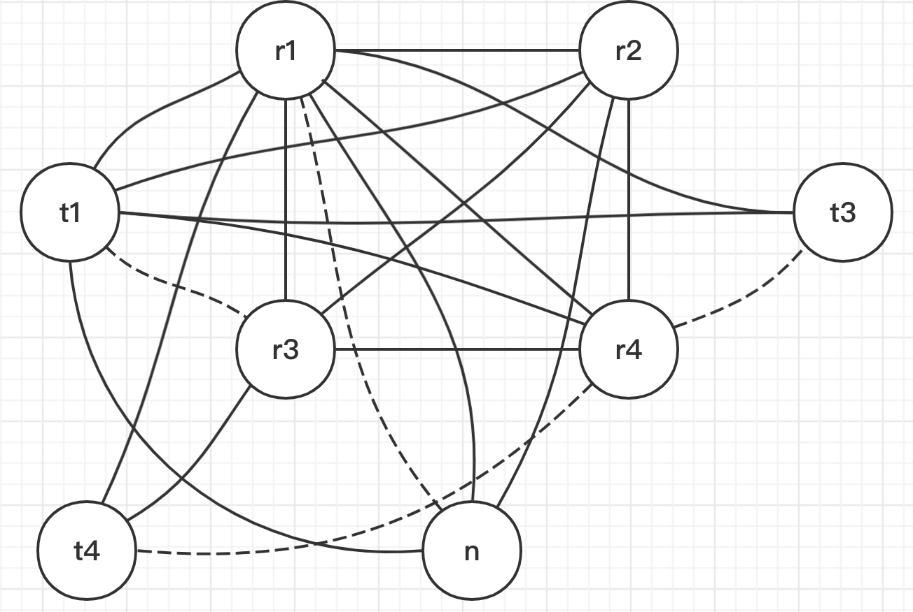
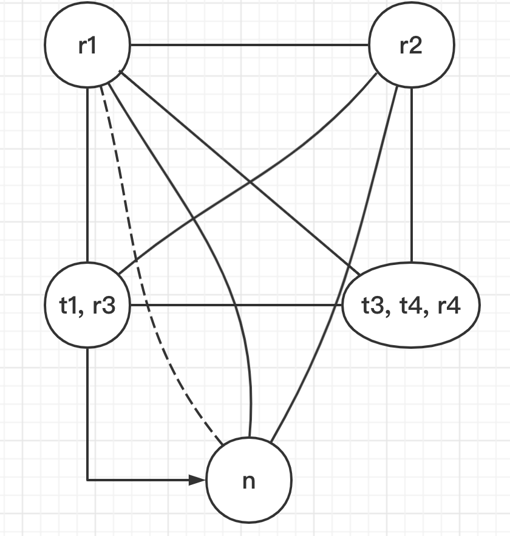

# Tiger Compiler Labs in C++

## Contents
- [编译原理 tiger 答辩](#编译原理-tiger-答辩)
	- [Lab1: Straight-line Program Interpreter](#Lab1:-Straight-line-Program-Interpreter)
	- [Lab2: Lexical Analysis](#Lab2:-Lexical-Analysis)
	- [Lab3: Parsing](#Lab3:-Parsing)
	- [Lab4: Type Checking](#Lab4:-Type-Checking)
	- [Lab5 Part1: Escape Analysis and Translation](#Lab5-Part1:-Escape-Analysis-and-Translation)
	- [Lab5: Tiger Compiler without register allocation](#Lab5:-Tiger-Compiler-without-register-allocation)
	- [Lab6: Register Allocation](#Lab6:-Register-Allocation)
	- [总结](#总结)
- [编译原理期末整理](#编译原理期末整理)
	- [静态链 & 逃逸分析](#静态链-&-逃逸分析)
	- [活跃分析 & 寄存器分配](#活跃分析-&-寄存器分配)
	- [指令选择](#指令选择)
	- [垃圾收集](#垃圾收集) 
- [Code Frame Description](#Code-Frame-Description)
  - [Overview](#overview)
  - [Difference Between C Labs and C++ Labs](#difference-between-c-labs-and-c-labs)
  - [Installing Dependencies](#installing-dependencies)
  - [Compiling and Debugging](#compiling-and-debugging)
  - [Testing Your Labs](#testing-your-labs)
  - [Submitting Your Labs](#submitting-your-labs)
  - [Formatting Your Codes](#formatting-your-codes)
  - [Other Commands](#other-commands)
  - [Contributing to Tiger Compiler](#contributing-to-tiger-compiler)
  - [External Documentations](#external-documentations)


# 编译原理 tiger 答辩

> 这是一个 **学生项目编译器**，包括了**避免语法和语义相互纠缠的抽象语法树**，**独立于寄存器分配的指令选择**，能使编译器前期阶段有更多灵活性的 **复写传播**，以及**防止从属于特定目标机的方法**。本编译器有一个简单而完整的后端，允许在指令选择之后进行 **寄存器分配**，能够生成完整的 **汇编代码**。

## Lab1: Straight-line Program Interpreter

在 `lab1` 中，我们实现了一个简单的 **直线式程序解释器**。

主要完成了各语句和各表达式的 `int maxargs(A_stm)` 和 `void interp(A_stm)` 两个函数，分别用来告知给定语句中任意子表达式内的 `print` 语句的参数个数和进行”解释“。

主要代码位于 `src/straightline/slp.h` 和 `src/straightline/slp.cc` 中。代码样例如下所示：

```C++
int A::CompoundStm::MarArgs() const {
	return stm1->MaxArgs() > stm2->MaxArgs() ? stm1->MaxArgs() : stm2->MaxArgs();
};

Table* A::CompoundStm::Interp(Table* t) const {
	return stm2->Interp(stm1->Interp(t));
};
```

注：这个 `lab` 仅用于帮助我们更好地了解 **环境**、**抽象语法**、**递归结构** 和 **代码风格** 等，不属于  `tiger` 编译器的一部分。

## Lab2: Lexical Analysis

在 `lab2` 中，我们运用 **flexc++** 来完成 `tiger` 的 **词法分析** 部分。**词法分析** 是指将输入分解成一个个独立的词法符号，即 “单词符号”（token）。

主要完成了 **普通词法**、**字符串** 和 **嵌套注释** 三部分的词法分析。难点在于学会 **flexc++** 所使用的 [语法规则](https://fbb-git.github.io/flexcpp/manual/flexc++.html) 。 

主要代码位于 `src/tiger/lex/tiger.lex` 中。代码样例如下：

```C++
"+"			{adjust(); return Parser::PLUS; }
"if" 		{adjust(); return Parser::IF; }

/* Identifier and Integer */
[a-zA-Z][_a-zA-Z0-9]* 	{adjust(); string_buf_ = matched(); return PARSER::ID; }
[0-9]+ 		{adjust(); string_buf_ = matched(); return PARSER::INT; }

<COMMENT> {
	"*/" 	{adjustStr(); if (comment_level_) comment_level_--; else begin(StartCondition__::INITIAL); }
	.|\n 	{adjustStr(); }
	"/*" 	{adjustStr(); comment_level_++; }
}

```

## Lab3: Parsing

在 `lab3` 中，我们运用 **Bisonc++** 来完成 `tiger` 的 **语法分析**。**语法分析** 是指分析程序的短语结构。

主要完成了 **表达式**、**变量**、**函数声明**、**类型声明** 等方面的语法分析，其中运用 **定义优先级** 来解决 **冲突问题**。难点在于学会 **Bisonc++** 所使用的的 [语法规则](https://fbb-git.gitlab.io/bisoncpp/manual/bisonc++.html)。

主要代码位于 `src/tiger/parse/tiger.y` 中。代码样例如下：

```C++
%left OR
%left AND
%nonassoc EQ NEQ LT LE GT GE

%type <ty> ty

%start program

%%
program: exp {absyn_tree_ = std::make_unique<absyn::AbsynTree>($1); };

ty:
	ARRAY OF ID {$$ = new absyn::ArrayTy(scanner_.GetTokPos(), $3); } |
	ID {$$ = new absyn::NameTy(scanner_.GetTokPos(), $1); } |
	LBRACE tyfields RBRACE {$$ = new absyn::RecordTy(scanner_.GetTokPos(), $2); };
```

注：这个 `lab` 的实现有很多种，且可能会影响到后面的 `lab` 所生成的语法树等结构，单拿满分并不难，但如果存在小的 `bug` 可能会导致后面的 `lab` 无法完成，建议先简单完成等到之后的 `lab` 发现这部分错误再来修改。

## Lab4: Type Checking

在 `lab4` 中，我们完成了 `tiger` 的 **语义分析** 。**语义分析** 是指将变量的定义与它们的各个使用联系起来，检查每一个表达式是否有正确的类型，并将抽象语法转换成更简单的、适合于生成机器代码的表示。

主要完成了对各种 **表达式**、**变量** 和 **声明** 等的类型检查，并且会在遇到类型不匹配、参数个数不匹配等问题时进行 **报错** ，还有嵌套循环中的 _break_ 检查。

主要代码位于 `src/tiger/semant/semant.cc` 中。代码样例如下：

```C++
type::Ty* SimpleVar::SemAnalyze(env::VEnvPtr venv, env::TEnvPtr tenv, int labelcount, err::ErrorMsg* errormsg) const {
	env::EnvEntry* entry = venv->Look(sym_);
	if (entry && entry->kind_ == env::EnvEntry::VAR) {
		return ((env::EnvEntry*) entry)->ty_->ActualTy();
	} else {
		errormsg->Error(pos_, "undefined variable %s", sym_->Name()-.c_str());
		return type::IntTy::Instance();
	};
};
```

## Lab5 Part1: Escape Analysis and Translation

在 `lab5 Part1` 中，我们完成了 `tiger` 的 **逃逸分析** 和 **中间表示树** 部分。

**逃逸变量** 是指一个变量是传地址实参、被取了地址或者内层的嵌套函数对其进行了访问。在 _tiger_中，`record` 和 `array` 作为函数参数时都看做逃逸变量，不存在取地址情况，主要的逃逸变量来源于内层嵌套函数访问外层变量。

**中间表示** 是指一种抽象机器语言，可以表示目标机的操作而不需太多涉及机器相关的操作，且独立于源语言的细节。一个可移植的编译器先将源语言转换成 **IR**，然后再将 **IR** 转换成机器语言，这样便只需要 $N$ 个前端和 $M$ 个后端。

**逃逸分析** 部分利用 **递归** 主要完成了对各个变量是否是逃逸变量的标记。

主要代码位于 `src/tiger/escape/escape.cc` 。样例代码如下：

```C++
void SimpleVar::Traverse(esc::EscEnvPtr env, int depth) {
  esc::EscEnvPtr* t = env->Look(sym_);
  if (depth > t->depth)
  	*(t->escape_) = true;
  return;
}
```

**中间表示树** 部分将 **抽象表示** 中个别复杂事情（如数组下标、过程调用）化解成一组恰当的机器指令，尤其是对 `While` 和 `For` 循环语句的设计以及 **静态链** 和 **真值标号回填表** 等结构。

主要代码位于 `src/tiger/translate/translate.cc` 中。样例代码如下：

```C++
tr::ExpAndTy* CallExp::Translate(env::VEnvPtr venv, env::TEnvPtr tenv, tr::Level* level, temp::Label* label, err::ErrorMsg* errormsg) const {
  auto *exp_list = new tree::ExpList();
  auto fent = (env::FunEntry *)venv->Look(func_);
  
  auto staticLink = tr::GetStaticLink(fent->level_->parent_, level);
  exp_list->Append(staticLink);
  for (auto it : args->GetList()) {
    tr::ExpAndTy* res = it->Translate(venv, tenv, level, label, errormsg);
    exp_list->Append(res->exp_->UnEx());
  };
  
  type::Ty* ty;
  if (fent->result_ != nullptr) ty = fent->result_->ActualTy();
  else ty = type::VoidTy::Instance();
  
  tr::Exp* exp;
  if (fent->level_->parent_ == nullptr) {
    exp = new tr::ExExp(frame::ExternalCall(temp::LabelFactory::LabelString(func_), exp_list));
  } else {
    exp = newe tr::ExExp(new tree::CallExp(new tree::NameExp(func_), exp_list));
  };
  return new tr::ExpAndTy(exp, ty);
}
```

注：这个 `lab` 的 **中间表示树** 部分依赖于 **帧栈** 的实现，因此并没有设置检测。

## Lab5: Tiger Compiler without register allocation

在 `lab5` 中，我们完成了 `tiger` 的 **帧栈** 和 **指令选择** 部分。

**帧栈** 部分主要参考 `X86-64` 的帧栈模式，需要特殊考虑 `caller-saves`、`callee-saves`、超出 $6$ 个的函数参数以及静态链。

主要代码位于 `src/tiger/frame/frame.h` 和 `src/tiger/frame/x64frame.cc` 中。样例代码如下：

```C++
X64Frame::X64Frame(temp::Label* name, std::list<bool> escapes) {
	label = name;
	formals = new AccessList();
	
  s_offset = -8;
  int i = 1;
  int arg_num = escapes.size();
  for (auto it : escapes) {
    Access* a = AllocLocal(it);
    formals->Append(a);
    
    if (reg_manager->GetNthArg(i)) {
      save_args.push_back(new tree::MoveStm(a->ToExp(new tree::TempExp(reg_manager->FramePointer())), new tree::TempExp(reg_manager->GetNthArg(i))));
    } else {
      save_args.push_back(new tree::MoveStm(a->ToExp(
      	new tree::TempExp(reg_manager->FramePointer())),
        new tree::MemExp(
        	new tree::BinopExp(tree::BinOp::PLUS_OP,
        		new tree::TempExp(reg_manager->FramePointer()),
        			new tree::ConstExp((arg_num - i + 2) * frame::wordsize)))));
    }
    ++i;
  }
}
```

**指令选择** 部分和 `Translate` 部分直接挂钩，特别注意静态链的处理以及寄存器的保护等。

主要代码位于 `src/tiger/codegen/codegen.cc` 。样例代码如下：

```C++
temp::Temp* TempExp::Munch(assem::InstrList &instr_list, std::string_view fs) {
  if (temp_ != reg_manager->FramePointer()) {
    return temp_;
  };
  
  // else replace it by rsp and framesize
  temp::Temp* reg = temp::TempFactory::NewTemp();
  std::stringstream stream;
  stream << "leaq" << fs << "_framesize(%rsp), `d0";
  std::string assem = stream.str();
  instr_list.Append(new assem::OperInstr(assem, new temp::TempList(reg), nullptr, nullptr));
  return reg;
};
```

## Lab6: Register Allocation

在 `lab6` 中，我们完成了 `tiger` 的 **活跃分析** 和 **寄存器分配** 部分。

在 **活跃分析** 部分，我们在 `src/tiger/liveness/flowgraph.cc` 中完成了程度 **控制流图** 的构建，主要是给顺序执行的语句前后结点添加边、以及处理直接跳转 `jmp` 情况。代码如下：

```C++
void FlowGraphFactory::AssemFlowGraph() {
  auto label2node = label_map_.get();
  tab::Table<assem::Instr, FNode> instr2node;
  
  FNodePtr prev = NULL;
  for (auto &it : instr_list_->GetList()) {
    auto cur = flowgraph_->NewNode(it);
    instr2node.Enter(it, cur);
    
    if (prev) flowgraph_->AddEdge(prev, cur);
    
    if (it->kind_ == assem::Instr::LABEL) label2node->Enter(((assem::LabelInstr *)it)->label_, cur);
    
    if (it->kind_ == assem::Instr::OPER && ((assem::OperInstr *)it)->assem_.find("jmp") == 0) prev = NULL;
    else prev = cur;
  };
  
  for (autp &it : instr_list_->GetList()) {
    if (it->kind_ == assem::Instr::OPER && ((assem::OPerInstr*) it)->jumps_) {
      std::vector<tempL::Label *>* labels = ((assem::OperInstr*) it)->jumps_->labels_;
      
      for (auto &iter : *((assem::OperInstr *) it)->jumps_->labels_) {
        auto jmp_node = instr2node.Look(it);
        auto label_node = label2node->Look(iter);
        flowgraph_->AddEdge(jmp_node, label_node);
      };
    };
  };
};
```

我们在 `src/tiger/liveness/liveness.cc` 中 `livemap` 函数，根据 **活跃分析的数据流方程** ：

$$
\begin{align}
in[n] &= use[n] \cup (out[n] - def[n]) \\
out[n] &= \bigcup_{s \in succ[n]} in[s] \\
\end{align}
$$

并且巧妙利用 **集合的不可重复性** 来完成 **不动点的判定** ，完成了所有结点的 **活跃性分析** 。代码如下：

```C++
void LiveGraphFactory::LiveMap() {
	auto in = in_.get();
	auto out = out_.get();
	for (auto &it : flowgraph_->Nodes()->GetList()) {
		in->Enter(it, new temp::TempList());
		out->Enter(it, new temp::TempList());
	};
	
	bool fixed_point = false;
	
	while (!fixed_point) {
		fixed_point = true;
		
		for (auto &it: flowgraph_->Nodes()->GetList()) {
			auto cur = it->NodeInfo();
			
			/* Add cur->Use() + cur->Out() - cur->Def() into in_ */
			auto in_1 = ToSet(out->Look(it)->GetList());
			for (auto &iter : cur->Def()->GetList()) 
				in_1.erase(iter);
			for (auto &iter : cur->Use()->GetList())
				in_1.insert(iter);
			/* Judge whether change the original in_ TempList */
			if (in_1 != Toset(in->Look(it)->GetList())) {
				fixed_point = false;
				in->Set(it, ToTempList(in_1));
			};
			
			std::set<temp::Temp *> out_1;
			for (auto &iter : it->Succ()->GetList())
				for (auto &iterator : in->Look(iter)->GetList())
					out_1.insert(iterator);
			/* Judge whether change the original out_ TempList */
			if (out_1 != ToSet(out->Look(it)->GetList())) {
				fixed_point = false;
				out->Set(it, ToTempList(out_1));
			};
		};
	};
	return;
}
```

然后，我们在 `src/tiger/liveness/liveness.cc` 中 `InterGraph` 函数中完成了冲突图的构建，主要参考以下三个原则：

- 对于任何对变量 $a$ 定值 `def` 的 **非传送指令**，以及在该指令处是 **出口活跃** `out` 的变量 $b_1, \cdots, b_j$ ，添加冲突边 $(a, b_1), \cdots, (a, b_j)$ 。
- 对于 **传送指令** $a \leftarrow c$，如果变量 $b_1, \cdots, b_j$ 在该指令处是 **出口活跃** `out` 的，则对每一个 **不同于 $c$ 的 $b_i$** 添加冲突边 $(a, b_1), \cdots, (a, b_j)$ 。
- **机械寄存器** 相互之间都一定有冲突边。

主要代码如下：

```C++
/* 1st & 2nd principle */
for (auto &it : flowgraph_->Nodes()->GetList())
  	for (auto &iter : it->NodeInfo()->Def()->GetList())
    		for (auto &iterator : out->Look(it)->GetList())
          	if (iter != iterator
               && !(it->NodeInfo()->kind_ == assem::Instr::MOVE && it->NodeInfo()->Use()->GetList().front() == iterator)) {
              live_graph_.interf_graph->AddEdge(temp_node_map_->Look(iter), temp_node_map_->Look(iterator));
              live_graph_.interf_graph->AddEdge(temp_node_map_->Look(iterator), temp_node_map_->Look(iter));
            };
/* 3rd principle */
for (auto iter : reg_manager->Registers()->GetList())
  	for (auto iterator : reg_manager->Registers()->GetList())
      	if (iter != iterator) {
          live_graph_.interf_graph->AddEdge(temp_node_map_->Look(iter), temp_node_map_->Look(iterator));
          live_graph_.interf_graph->AddEdge(temp_node_map_->Look(iterator), temp_node_map_->Look(iter));
        };
```

在 **寄存器分配** 部分，我们主要参考书上 **图着色算法** ，流程如下：

1. **构造**：构造冲突图。在 `liveness` 部分实现。

2. **简化**：每次一个地从图中删除 **低度数** 的 （度 $\lt K$）与 **传送无关** 的结点。

```C++
/* Find a degree temp whose degree < K */
live::INodePtr chosen = NULL;
for (auto &it : node_list) {
  if (temp_is_in_stack[it]) continue;
  if (chosen = NULL || temp_degree[chosen] > temp_degree[it]) chosen = it;
  if (temp_degree[chosen] < K) break;
};
/* Push it into stack */
for (auto &it: chosen->Pred()->GetList())
	temp_degree[it]--;

temp_degree[chosen] = 0;
stack.push(chosen);
temp_is_in_stack[chosen] = true;
```

3. **合并**：对简化阶段得到的简化图实施保守的合并，即遵循 $Briggs$ 原则或 $George$ 原则，但在我的实现中并省去了合并这一环节。

4. **冻结**：如果 **简化** 和 **合并** 都不能再进行，就寻找一个 **度数较低** 的 **传送有关** 的结点，我们 **冻结** 这个结点所关联的传送指令，即放弃对这些传送指令进行合并的希望。显然，因为我的实现不考虑 **合并**，所以自然也就没有 **冻结** 这一阶段。

5. **溢出**：如果没有低度数的结点，选择一个潜在可能溢出的高度数结点并将其压入栈。我的实现中，在 **简化** 部分选择结点时并没有完全限制结点的度数必须小于 $K$ ，而是如果小于 $K$ 则满足条件直接选择该结点，如果均不满足则选择度数最小的那个高度数结点，因此也就包含了溢出部分。

6. **选择**：弹出整个栈并指派颜色。先尝试给栈中的每一个结点分配颜色。

```C++
auto test_is_precolored = reg_manager->temp_map_->Look(top->NodeInfo());
if (test_is_precolored)
	map->Enter(top->NodeInfo(), new std::string(*test_is_precolored));
else {
  /* Find used */
  std::set<std::string> used;
  for (auto &it : top->Succ()->GetList()) {
    auto pre_color = reg_manager->temp_map_->Look(it->NodeInfo());
    if (pre_color) used.insert(*pre_color);
    else {
      auto has_color = map->Look(it->NodeInfo());
      if (has_color) used.insert(*has_color);
    };
  };

  /* If no color to use */
  if (used.size() == colors.size()) {
  	can_select = false;
  	break;
  };
  /* Find usable color */
  std::string usable;
  for (auto &it : colors)
  	if (!used.count(it)) {
  		usable = it;
  		break;
	};
  /* Color */
	map->Enter(top->NodeInfo(), new std::string(usable));
}
```

如果分配不成功，则实际溢出一个高度数结点，然后再重新进行 **简化** 、**选择** 等流程。

```C++
if (can_select) {
	result.coloring = map;
	break;
} else {
	/* Spill and rerun */
  result.spills->Append(stack.top());
  stack.pop();
  delete map;
};
```

最后，我们在 `src/tiger/regalloc/regalloc.cc` 中整合整个寄存器分配的全过程，主要算法如下：

```C++
1. AssemFlowGraph(); /* 构造流程图 */
2. Liveness(); /* 活跃分析 */
3. color.GetResult(); /* 预着色 */
4. if (success) return; /* 成功着色，整理并返回 */
5. else { /* 不成功着色，实际溢出一个高度数结点并改写程序，将该结点写入帧栈 */
  instr_list->Insert(iter, new assem::OperInstr("leaq " + frame_label->Name() + "_framesize(%rsp), `d0", new temp::TempList(new_temp), NULL, NULL));
  instr_list->Insert(iter, new assem::OperInstr("addq $" + std::to_string(frame_->s_offset) + ", `d0", new temp::TempList(new_temp), NULL, NULL));
  instr_list->Insert(iter, new assem::OperInstr("movq (`s0), `d0", new temp::TempList(it->NodeInfo()), new temp::TempList(new_temp), NULL));
}
```

##  总结

至此，一个简单完整的 `tiger` 编译器就完成了。尽管 $TA$ 好心地布置了 `lab7` 垃圾收集作为奖励，但毕竟期末考试将近且我也学无余力，就没有再去完成。`编译原理` 这门课程可以称得上软院最难的课程之一，尤其是要根据虎书的 _tiger_ 实现部分和 $TAs$ 已经魔改了无数版本的代码框架，来实现一个较为底层的完整编译器。

虽然我将无数个日日夜夜 “浪费” 在了这个 $Naive$ 的编译器上，但我真的感受到了程序员应该要专注要严谨，一个很小的 `bug` 换来的都可能是无数的 `debug` 时间，尤其是 `lab5` 和 `lab6` 代码模块间相互作用以及算法的运用，都让我收益匪浅。很开心能够上到这样一门极高质量的课程，完成这个编译器的大作业也让我成就感刷满，痛并快乐着~

最后，感谢上海交通大学软件学院院长 **臧斌宇** 教授和 **吴明瑜** 老师的精彩授课，**李哲** 助教在 `lab` 完成方面给了我很多帮助与指导。


# 编译原理期末整理

## 静态链 & 逃逸分析

```C++
/* A program to solve the 1-N queens problem */
let
 	var maxN := 10
	var emptySymbol := " ."

	function printSquare(hasQueen:int) =
 		let
 			var queenSymbol := " 0"
 		in print(if hasQueen then queenSymbol else emptySymbol) end
     
 	function nQueens(N:int) =
 		let
 			type intArray = array of int
 			
      var row := intArray [ N ] of 0
 			var col := intArray [ N ] of 0
      var diag1 := intArray [N+N-1] of 0
      var diag2 := intArray [N+N-1] of 0
      
      function printBoard() =
         (for i := 0 to N-1
         		do(for j := 0 to N-1
         			do printSquare(col[i]=j); print("\n"));
         print("\n"))
        
      function try(c:int) =(
        if c = N then printBoard()
        else for r := 0 to N-1
          do if row[r]= 0 & diag1[r+c]=0 & diag2[r-c+N-1]=0
          	then (row[r]:=1; diag1[r+c]:=1; diag2[r-c+N-1]:=1;
              col[c]:=r;
              try(c+1);
              row[r]:=0; diag1[r+c]:=0; diag2[r-c+N-1]:=0)
      )
 	in try(0) end
in
	for n := 1 to maxN
 		do(print("Solving ");printi(n);print(" queens problem...\n\n");
       nQueens(n);
       print("\n"))
end
```

> 1. Suppose that we implement the nested functions using an access link. Please draw the access link in each of the activation records on the stack based on the following function invocations. (9’)
a. nQueens->try->try
b. nQueens->try->printBoard
c. nQueens->try->printBoard->printSquare

**画出函数层次分级图**

- outermost
	- printSquare
	- nQueens
		- printBoard
		- try

**根据调用函数顺序画出栈结构**
**每层的 _Access Link_ 指向上一层次函数的 _Access Link_**

e.g.


> 2. Suppose that we implement nested functions using displays. Please draw the display
in each of the activation records on the stack based on the following function
invocations. (9’) 
a. nQueens->try->try
b. nQueens->try->printBoard
c. nQueens->try->printBoard->printSquare

**根据第一问中的 _Access Link_ 指向，来确定 d 的标号和指向**
**outermost 的 _Access Link_ 总是 d[0]**
**其他函数看箭头所指向的上一层 _Access Link_ 来确定 d 的标号**
**左侧 d 的直接指向总是所对应的栈的最深的位置处**

e.g.


> 3. Determine whether the following local variables can escape and explain your reasons.(12’)
> | Variable | Escape(Y \| N) | Your Reason |
> | :--: | :--: | :--: |
> | maxN (Line 4) | N | 没有被嵌套的函数访问，而且是简单的数据类型，能放入寄存器中 |
> | emptySymbol (Line 5) | Y | 字符串变量是指向字符串的指针，虽然可以存放
寄存器中，被嵌套的 printSquare 函数访问 |
> | queenSymbol (Line 9) | N | 字符串变量是指向字符串的指针，且只被当前函数所访问 |
> | col (line 17) | Y | 被嵌套的 try 函数访问 |

**如果一个变量是传地址实参，或者它被取了地址（使用 C 语言中的 & 操作），或者内次的嵌套函数对其进行了访问，我们则称该变量是逃逸的（escape）**
**tiger 中传地址实参指的是函数参数中有 _Record_ 或者 _Array_ 类型**
**tiger 中没有取地址操作**
**tiger 中嵌套是最常见造成变量逃逸的原因**

------

## 活跃分析 & 寄存器分配

```C++
int nfactor (int n) {
  if (n <= 1) return 1;
  return n * nfactor(n – 1);
}
```

```C++
nfactor:
    t1 <- r3
    t2 <- r4
    n <- r1
    cmp n, 1
    jle end
    r1 <- (n – 1)
    call nfactor
    r1 <- r1 * n
    jmp ret
	end:
		r1 <- 1
	ret:
		r3 <- t1
		r4 <- t2
		return
```

> Several things are worth noting in the instructions:
  - There are **four** hardware registers in all.
  - The compiler passes parameters using registers. (The first parameter goes to **r1**)
  - **r1**,**r2** is **caller-saved** while **r3**,**r4** are **callee-saved**.
  - The **return value** will be stored in **r1**.
  - **t1**, **t2**, **n** are temporary registers.

> 1. Draw a control flow graph instruction-by-instruction. (4’)

**有 jmp 则需更改那根线的指向，有 je、jne、jl、jg、jle、jge 则需多加一根线指向可能跳转的位置的下一条指令，其他的按照指令出现顺序画即可**


> 2. Fill up the following def/use/in/out chart. (10’)

**def：对变量或临时变量的赋值。
use：出现在赋值号右边（或其他表达式中）的变量。
活跃的：存在一条边从这条边通向该变量的一个 use 的有向路径，并且此路径不经过该变量的任何 def。
in：如果一个变量在一个结点的所有入边上均是活跃的。
out：如果一个变量在一个结点的所有出边上均是活跃的，则该变量在该结点是出口活跃的。
pred[n]：结点 n 的所有前驱结点的集合。
succ[n]：结点 n 的所有后继结点的集合。**

活跃分析的数据流方程

$$
\begin{align}
in[n] &= use[n] \cup (out[n] - def[n]) \\
out[n] &= \bigcup_{s \in succ[n]} in[s] \\
\end{align}
$$


* caller-saved 需要放在 call 指令的 def 处，传递函数参数的寄存器需要放在 call 指令的 use 处。
* callee-saved 、存放函数返回值的寄存器 需要放在 return 指令的 use 处，return 指令的 def 一定为空，use in out 一定相同。

> 3. Draw the interference graph for the program. Please use dashed lines
for move edges and solid line for real interference edges. (10’)

- **对于任何对变量 $a$ 定值（def 集合）的非传送指令，以及在该指令处是 出口活跃（out 集合） 的变量 $b_1, \dots, b_j$，添加冲突边 $(a, b_1), \dots, (a, b_j)$。**
- **对于传送指令 $ a \leftarrow c$，如果变量 $b_1, \dots, b_j$ 在该指令处是 出口活跃（out 集合） 的，则对每一个不同于 $c$ 的 $b_i$ 添冲突边 $(a, b_1), \dots, (a, b_j)$。**
- **机械寄存器之间互相之有一定冲突边。**


> 4. Adopt the graph-coloring algorithm to allocate registers for temporaries. (15’)

流程：
1. 构造：构造冲突图，并用虚线指出传送有关的结点（即传送指令的源操作数和目的操作数之间连接虚线）。

2. 简化：每次一个地从图中删除 **低度数（度数 $\lt$ K）**、**传送无关** 的结点。

3. 合并：对一条传送指令的源操作数和目的操作数进行合并成为新的结点，并且遵守以下任一原则即可。
	- Briggs：结点 $a$ 和 $b$ 合并产生的结点 $ab$ 的 **高度数（度 $\ge K$）**邻结点的个数少于 $K$。
	- George：对于 $a$ 的任一邻居 $t$，要么 $b$ 与 $t$ 已经有冲突，要么 $t$ 是 **低度数（度 $\lt K$** 的结点。
	
	**重复进行 _简化_ 和 _合并_ 过程，直到仅剩下 _高度数结点_ 或 _传送有关结点_ 为止**。

4. 冻结：如果 _简化_ 和 _合并_ 都不能再进行，就寻找一个 **度数较低**、**传送有关** 的结点，冻结这个结点所关联的所有 _传送指令_：放弃对那些传送指令进行合并的希望。**重新进行简化和合并阶段**。

5. 溢出：如果没有低度数结点，选择一个潜在可能溢出的高度数结点并将其压栈。

6. 选择：弹出整个栈并指派颜色。

e.g.

观察可知，原图很难简化和合并，所以我们选择溢出 $r4$ 并重写指令。


- 重新构造冲突图如下。

  

- 根据 Briggs 法则，选择传送指令相关的 $t1$ 和 $t3$ 结点进行合并，得到冲突图如下。

  

- 根据 Briggs 法则，选择传送指令相关的 $t3$ 和 $r4$、$t4$ 和 $r4$ 结点进行合并，得到冲突图如下。

  

- 所有传送指令都是受抑制的，可以消除。

- 依次简化压栈 $n$，$r1$，$r2$，$t1$ & $r3$，$t3$ & $t4$ & $r4$。

- 分配 $r4$ 给 $n$，分配 $r3$ 给 $t1$，分配 $r4$ 给 $t3$ 和 $t4$。

- 染色成功，重写指令并消除多余传送指令，结果如下。

```c++
M[t2] <- r4
r4 <- r1
cmp r4, 1
jle end
r1 <- (r4 - 1)
call nfactor
r1 <- r1 * r4
jmp ret
r1 <- 1
r4 <- M[t2]
return
```

------

## 指令选择


> 1. In the course, we have learnt **maximum munch algorithm** to tile the
IR tree. Please use this algorithm to tile the IR tree above. **Draw your
tiles, write the corresponding instruction sequences** after tiling,
and **calculate the cost** of your instruction sequences. (10’)

**Maximal Munch 算法（P138）**
从树的根节点开始，寻找适合它的 **最大瓦片（覆盖结点数最多的瓦片）**，用这个瓦片覆盖根节点，同时也可能会覆盖根节点附近的其他几个结点。覆盖根节点后，遗留下了若干子树，然后，对每一棵子树重复相同的算法。

**注：在 Jouette 体系结构中，寄存器 $r0$ 总是包含 0。**


再分块**后序遍历**来生成相应指令，原则就是从底向上，先生成出上层所需的内容。

```C++
ADD			r1 <- r0 + A				1
ADDI 		r2 <- rx + B				1
MOVEM 	M[r1] <- M[r2]			4
				r2 <- M[r2]			
ADD 		r1 <- r0 + D				1
LOAD  	r3 <- M[r0 + E]			2
DIV  		r3 <- ry / r3				1
ADDI 		r3 <- r3 + F				1
MOVE 		M[r3] <- M[r1]			4
  			r1 <- M[r1]
SUBI 		r1 <- r1 - G				1
STORE  	M[r2 + C] <- r1			2
```

$$
cost = 1 + 1 + 4 + 1 + 2 + 1 + 1 + 4 + 1 + 2 = 18
$$

> 2. **Maximum munch algorithm** is an **optimal** tiling algorithm, and will not always generate tiles with smallest cost. A **dynamic-programming algorithm** can find the **optimum** tiling to the IR tree.
Please use the dynamic-programming algorithm to tile the IR tree
above. **Draw your tiles, write the corresponding instruction
sequences** after tiling, and **calculate the cost** of your instruction
sequences. (15’)

**动态规划算法（P140）**
自底向上，首先递归求出结点 $n$ 的所有儿子（和孙子）的代价，然后将每一种树型（瓦片种类）与结点 $n$ 进行匹配。


```C++
ADD			r1 <- r0 + A				1
ADDI 		r2 <- rx + B				1
MOVEM 	M[r1] <- M[r2]			4
				r2 <- M[r2]			
ADD 		r1 <- r0 + D				1
LOAD  	r3 <- M[r0 + E]			2
DIV  		r3 <- ry / r3				1
ADDI 		r3 <- r3 + F				1
MOVE 		M[r3] <- M[r1]			4
  			r1 <- M[r1]
SUBI 		r1 <- r1 - G				1
STORE  	M[r2 + C] <- r1			2
```

$$
cost = 1 + 1 + 4 + 1 + 2 + 1 + 1 + 4 + 1 + 2 = 18
$$

------

## 垃圾收集

> 1. Compare copying collection with mark & sweep collection, what’s the **pros & cons** of **copying collection?** (4’)

- 优点：减少内存碎片化，操作简单复杂性低。
- 缺点：如果大部分变量存活时间很长，会导致内存拷贝过多，overhead 很大，而且复制回收只能用一半内存空间。

> 2. In the course, we have learnt that garbage collection help us recycle heap space occupied by non-live variables. How does the program reuse space in stack
frame(spills in pre-allocated stack) occupied by non-live variables? (3’)

对溢出变量染色，进行内存分配，这样可以把活跃范围不重叠的溢出变量分配到同一个
内存地址处。

> 3. When a garbage collection based on reachability analysis is about to happen, the program runtime usually scan stack frame and use reference variables in stack as roots. If a reference variable is not live, will we still use it as a root? Why? (3’)

会，活性分析是编译时的工作，而垃圾回收是运行时做的，它无法获取到变量的活跃信
息。

> 4. Use copying collection to finish the following datagram. You need to draw the memory state and pointer after forwarding roots and scanning. You can refer to figure 13-4 in the Chinese textbook or figure 13.10. in the English textbook (10’)


# Code Frame Description

## Overview

We rewrote the Tiger Compiler labs using the C++ programming language because some features in C++ like inheritance and polymorphism
are more suitable for these labs and less error-prone.

We provide you all the codes of all labs at one time. In each lab, you only
need to code in some of the directories.

## Difference Between C Labs and C++ Labs

1. Tiger compiler in C++ uses [flexc++](https://fbb-git.gitlab.io/flexcpp/manual/flexc++.html) and [bisonc++](https://fbb-git.gitlab.io/bisoncpp/manual/bisonc++.html) instead of flex and bison because flexc++ and bisonc++ is more flexc++ and bisonc++ are able to generate pure C++ codes instead of C codes wrapped in C++ files.

2. Tiger compiler in C++ uses namespace for modularization and uses inheritance and polymorphism to replace unions used in the old labs.

3. Tiger compiler in C++ uses CMake instead of Makefile to compile and build the target.

<!---4. We've introduced lots of modern C++-style codes into tiger compiler, e.g., smart pointers, RAII, RTTI. To get familiar with the features of modern C++ and get recommendations for writing code in modern C++ style, please refer to [this doc](https://ipads.se.sjtu.edu.cn/courses/compilers/tiger-compiler-cpp-style.html) on our course website.-->

## Installing Dependencies

We provide you a Docker image that has already installed all the dependencies. You can compile your codes directly in this Docker image.

1. Install [Docker](https://docs.docker.com/).

2. Run a docker container and mount the lab directory on it.

```bash
# Run this command in the root directory of the project
docker run -it --privileged -p 2222:22 -v $(pwd):/home/stu/tiger-compiler ipadsse302/tigerlabs_env:latest  # or make docker-run
```

## Compiling and Debugging

There are five makeable targets in total, including `test_slp`, `test_lex`, `test_parse`, `test_semant`,  and `tiger-compiler`.

1. Run container environment and attach to it

```bash
# Run container and directly attach to it
docker run -it --privileged -p 2222:22 \
    -v $(pwd):/home/stu/tiger-compiler ipadsse302/tigerlabs_env:latest  # or `make docker-run`
# Or run container in the backend and attach to it later
docker run -dt --privileged -p 2222:22 \
    -v $(pwd):/home/stu/tiger-compiler ipadsse302/tigerlabs_env:latest
docker attach ${YOUR_CONTAINER_ID}
```

2. Build in the container environment

```bash
mkdir build && cd build && cmake .. && make test_xxx  # or `make build`
```

3. Debug using gdb or any IDEs

```bash
gdb test_xxx # e.g. `gdb test_slp`
```

**Note: we will use `-DCMAKE_BUILD_TYPE=Release` to grade your labs, so make
sure your lab passed the released version**

## Testing Your Labs

Use `make`
```bash
make gradelabx
```
or run the script manually
```bash
./scripts/grade.sh [lab1|lab2|lab3|lab4|lab5|lab6|all] # e.g. `./scripts/grade.sh lab1`
```

You can test all the labs by
```bash
make gradeall
```

## Submitting Your Labs

**Run `make register` and input your name in English and student ID.** You can
check it in the `.info` file generated later.

We are using CI in GitLab to grade your labs automatically. **So please make
sure the `Enable shared runners for this project`
under `Your GitLab repo - Settings - CI/CD` is turned on**.

Push your code to your GitLab repo
```bash
git add somefiles
git commit -m "A message"
git push
```

**Wait for a while and check the latest pipeline (`Your GitLab repo - CI/CD -
Pipelines`) passed. Otherwise, you won't get a full score in your lab.**

## Formatting Your Codes

We provide an LLVM-style .clang-format file in the project directory. You can use it to format your code.

Use `clang-format` command
```
find . \( -name "*.h" -o -iname "*.cc" \) | xargs clang-format -i -style=file  # or make format
```

or config the clang-format file in your IDE and use the built-in format feature in it.

## Other Commands

Utility commands can be found in the `Makefile`. They can be directly run by `make xxx` in a Unix shell. Windows users cannot use the `make` command, but the contents of `Makefile` can still be used as a reference for the available commands.

## Contributing to Tiger Compiler

You can post questions, issues, feedback, or even MR proposals through [our main GitLab repository](https://ipads.se.sjtu.edu.cn:2020/compilers-2021/compilers-2021/issues). We are rapidly refactoring the original C tiger compiler implementation into modern C++ style, so any suggestion to make this lab better is welcomed.

## External Documentations

You can read external documentations on our course website:

- [Lab Assignments](https://ipads.se.sjtu.edu.cn/courses/compilers/labs.shtml)
- [Environment Configuration of Tiger Compiler Labs](https://ipads.se.sjtu.edu.cn/courses/compilers/tiger-compiler-environment.html)
<!---- [Tiger Compiler in Modern C++ Style](https://ipads.se.sjtu.edu.cn/courses/compilers/tiger-compiler-cpp-style.html)-->

